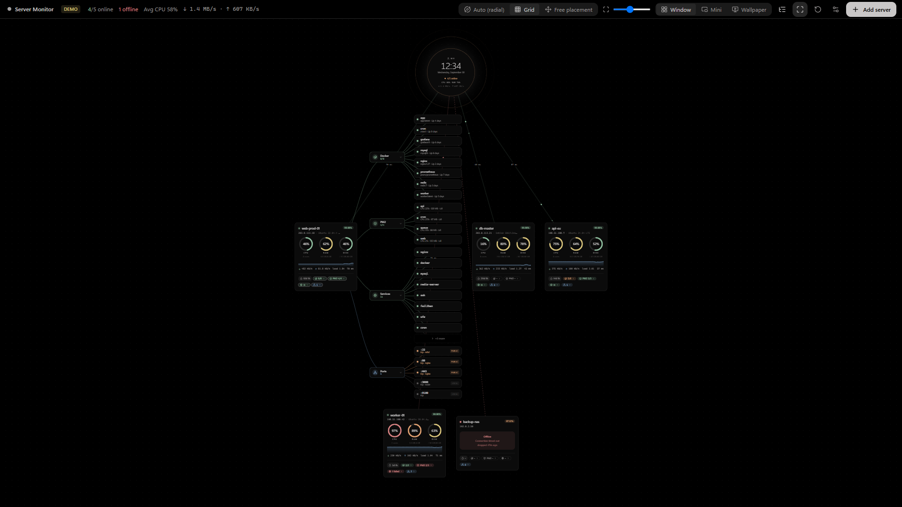
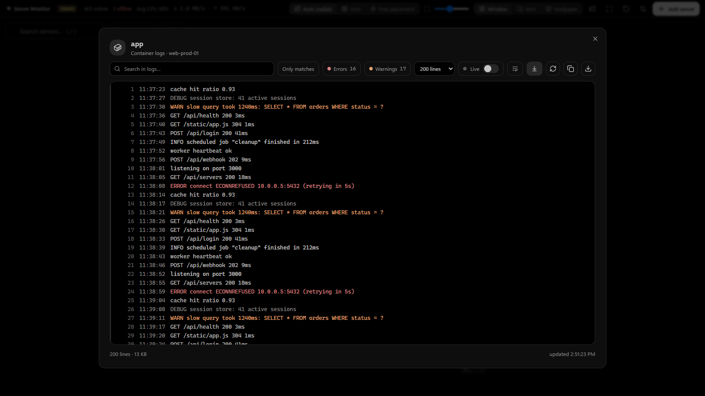
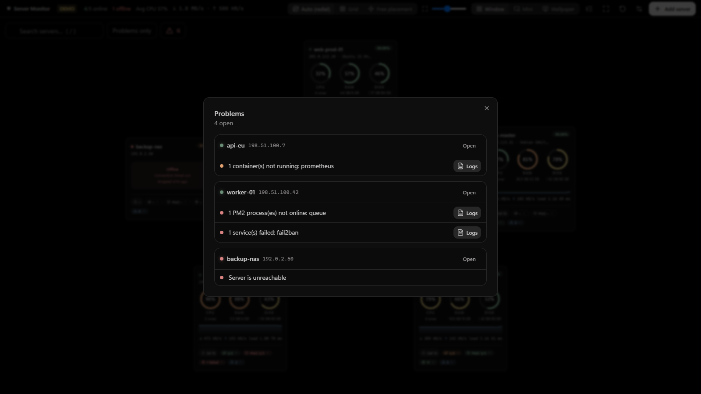
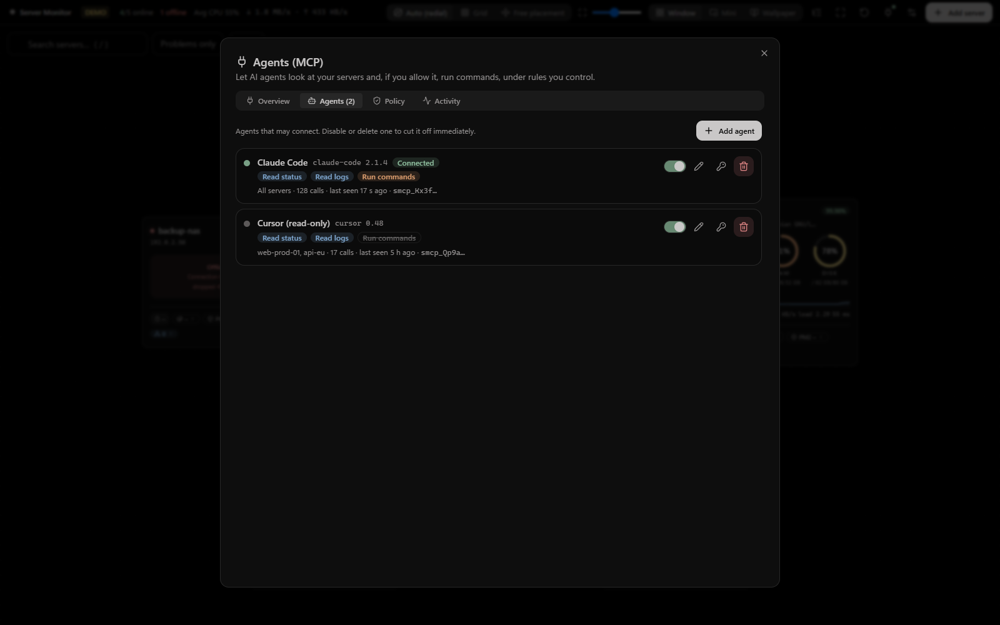
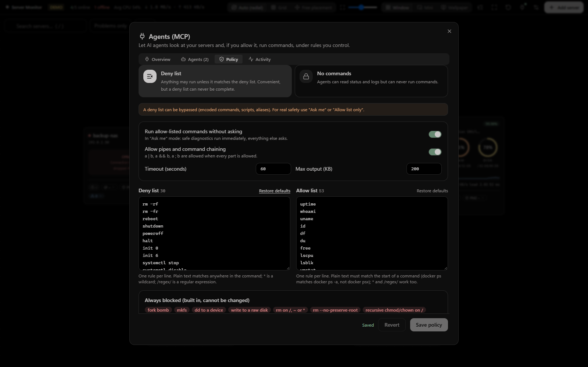

<div align="center">

# Server Monitor

**Your servers, live on your desktop.** An app for **Windows, macOS and Linux** that watches your Linux servers over SSH and draws them as a live flowchart with you at the centre: as a normal window, a tiny always-on-top widget, or **as your desktop wallpaper**. AI agents can use it too, safely, through a built-in **MCP server** with permissions, allow/deny lists and approvals.

[](https://github.com/hacimertgokhan/server-monitor/actions/workflows/ci.yml)
[](LICENSE)


[Türkçe](README.tr.md) · [Watch the 20 s promo (with sound)](docs/media/promo.mp4) · [hacimertgokhan.com](https://hacimertgokhan.com)


</div>

## Features

**Monitoring**

- **Live per-server card**: CPU, RAM and disk rings that glide smoothly between values, CPU sparkline, network throughput, load, latency.
- **Uptime tracking**: server uptime plus measured availability (24 h / 7 d / 30 d) and outage counter.
- **Docker, PM2, systemd, ports**: running/total containers, PM2 processes, running and failed services, listening TCP/UDP ports with public/local exposure.
- **Expandable sub-trees**: click a Docker / PM2 / Services / Ports chip (or **Expand all**) to grow server → group → every container, process, service or port, colour-coded by health. Long lists show the most relevant items first with a "+N more" node.
- **Logs**: click a container, PM2 process or service (or use the tables in the detail view) to read its logs: search with highlighting, "only matches", error/warning filters, live refresh, copy and save.
- **Problems panel and desktop notifications**: offline servers, sustained high CPU/RAM/disk, stopped containers, errored PM2 processes and failed services, with configurable thresholds. Only _new_ problems are announced. Search (`/`) and a "problems only" filter.

**Views**

- **Three modes**: window, mini widget, and **live wallpaper** between your desktop icons and the system wallpaper.
- **Free or automatic layout**: radial, grid or free placement; global card size and per-card resize. Everything is remembered.
- **Tray / menu-bar app**: closing the window keeps monitoring in the background. `Ctrl+Alt+M` (`⌘⌥M` on macOS) always brings you back from wallpaper mode.
- **English and Turkish** UI (automatic, switchable in Settings).

**Root mode: terminal and files**

- **SSH terminal** like Termius: servers on the left, click one to open a real PTY terminal (`nano`, `vim`, `htop` work). Tabs, copy / paste, search, 12 colour themes, font and cursor settings.
- **File manager (SFTP)**: browse, edit text files, upload / download files and folders with progress, drag and drop, permissions.

**Agents (MCP)**

- A built-in **MCP server** lets agents such as Claude Code or Cursor list your servers, read status and logs and, if you allow it, run commands over your existing SSH connections. See [Agents (MCP)](#agents-mcp).

|                                                |                                                |
| ---------------------------------------------- | ---------------------------------------------- |
|  |      |
|     |  |
|   |              |
|        |        |
|        |                                                |

## Install

Download the installer for your system from the [latest release](https://github.com/hacimertgokhan/server-monitor/releases/latest):

| System  | File                                              | Notes                                                                                                                        |
| ------- | ------------------------------------------------- | ---------------------------------------------------------------------------------------------------------------------------- |
| Windows | `Server-Monitor-Setup-<version>.exe`              | Per-user install, no admin rights. Windows 10/11 (wallpaper mode also on 24H2+). SmartScreen may ask you to confirm.         |
| macOS   | `Server-Monitor-<version>-mac-arm64.dmg` / `-x64` | Apple Silicon or Intel. The app is not notarized yet: right-click it, choose **Open**, and confirm once.                     |
| Linux   | `.AppImage` or `.deb` (x64)                       | `chmod +x` the AppImage and run it, or `sudo apt install ./file.deb`. Credentials need a keyring (GNOME Keyring or KWallet). |

Platform notes:

- **Wallpaper mode** works on Windows and macOS, and on Linux under **X11**. Wayland compositors do not allow it, so the app falls back to the window. The wallpaper is not clickable: use the shortcut or the tray icon to return.
- **Linux tray**: some desktops (GNOME) have no tray, so closing the window quits the app there by default.
- **Credentials** are encrypted with the operating system (Windows DPAPI, macOS Keychain, Linux keyring). Without a keyring on Linux the app refuses to store passwords; SSH keys without a passphrase still work.

## Getting started

1. Click **Add server**, enter host, port and user, and either a password or an SSH private-key file.
2. **Test connection**, then **Save**. The card appears and starts updating every few seconds.
3. Click a card for details (Docker, PM2, services, ports, disks). Drag cards to place them freely, or pick _Auto_ / _Grid_ in the top bar.
4. Switch to **Wallpaper** in the top bar. To get back: the shortcut above, or the tray icon → _Window mode_.

Try it without any server: **Preview with demo** on the empty screen.

## Agents (MCP)

Open **Agents (MCP)** (plug icon in the top bar), switch it on, create an agent and give its token to your client.

```bash
# Claude Code
claude mcp add --transport http server-monitor http://127.0.0.1:8765/mcp --header "Authorization: Bearer <AGENT_TOKEN>"
```

```json
{ "mcpServers": { "server-monitor": { "url": "http://127.0.0.1:8765/mcp", "headers": { "Authorization": "Bearer <AGENT_TOKEN>" } } } }
```

Tools: `list_servers`, `get_server_status`, `list_issues`, `get_policy`, `get_logs` and (only when allowed) `run_command`. The app shows connected agents, lets you set each agent's permissions and server scope, and keeps an **activity log** of every call.

**You control what agents may run.** Pick a command mode:

| Mode                 | Behaviour                                                                                                                           |
| -------------------- | ----------------------------------------------------------------------------------------------------------------------------------- |
| **Ask me** (default) | Each command waits for your approval in a native dialog. Allow-listed diagnostics (`uptime`, `df`, `docker ps` …) run immediately.  |
| **Allow list only**  | Only commands matching the allow list run. Substitution, redirects and background jobs are refused because they cannot be verified. |
| **Deny list**        | Anything runs unless it matches the deny list. Convenient, but a deny list can never be complete.                                   |
| **No commands**      | Agents can read status and logs only.                                                                                               |

Rules are plain text, `*` wildcards or `/regex/`, editable in the app with a built-in **test box** that shows what would happen. A set of destructive commands (`rm -rf /`, `mkfs`, `dd of=/dev/…`, fork bombs …) is blocked in **every** mode and cannot be changed.

Safety design:

- Off by default. The endpoint binds to `127.0.0.1` only, rejects browser requests (`Origin`) and unexpected `Host` headers (DNS rebinding).
- One bearer token per agent; only its SHA-256 is stored and the token is shown once. Disable, rotate or delete an agent to cut it off immediately.
- Approvals use a native OS dialog, not the app's web view, so an agent can never approve itself.
- Per-agent permissions (status / logs / commands) and server scope; timeouts, output limits and a parallel-command limit.

## What runs on your servers

Monitoring uses only read-only commands, over a single persistent SSH connection per server:
`/proc/stat`, `/proc/meminfo`, `/proc/loadavg`, `/proc/uptime`, `/proc/net/dev`, `df`, `docker ps -a`, `pm2 jlist`, `systemctl list-units`, `ss` (or `netstat`). The log viewer runs `docker logs`, `pm2 logs --nostream` or `journalctl -u` for names the server itself reported.

- Linux hosts; systemd recommended. Missing tools simply show `–`.
- `docker` needs the user to be in the `docker` group (or root). `pm2` is only queried if its daemon socket already exists, because `pm2 jlist` would otherwise start a daemon.
- The environment of PM2 processes is discarded immediately and never stored.
- Only when you enable MCP and allow it, an agent can run additional commands, always under your policy.

## Security

| Concern            | What the app does                                                                                                                  |
| ------------------ | ---------------------------------------------------------------------------------------------------------------------------------- |
| Credentials        | Encrypted with Electron `safeStorage` (DPAPI / Keychain / keyring) in the app data folder. Refuses to store secrets in plain text. |
| Host keys          | Pinned on first connect. A changed key blocks the connection and warns about a possible MITM.                                      |
| Monitoring         | Fixed, read-only scripts (see `src/main/probe.ts`). Log names are validated and must come from the server's own listing.           |
| Agents (MCP)       | Off by default, loopback only, per-agent hashed tokens, policy + approvals + audit log (see above).                                |
| Renderer isolation | `contextIsolation`, sandbox, no Node integration, strict CSP in production builds, allow-listed external links.                    |
| Network            | Only your SSH connections and the local MCP endpoint. A GitHub request happens only when you press **Check for updates**.          |

Report vulnerabilities as described in [SECURITY.md](SECURITY.md).

## Development

Requires Node.js ≥ 22. The UI also runs in a browser with demo data.

```bash
npm install
npm run dev        # Electron app with hot reload
npm run dev:web    # UI only, in the browser, with demo data: http://localhost:5199/?mode=window|mini|wallpaper
npm run check      # lint + format check + typecheck + tests
npm run dist       # installer for the current OS into dist/ (dist:win, dist:mac, dist:linux)
npm run promo      # regenerate docs/media (needs Chrome + ffmpeg; narration uses Windows SAPI, fully headless)
```

```
src/main      Electron main process: SSH sessions, probes, storage, tray, window modes, notifications, MCP server
src/preload   Typed IPC bridge (contextBridge)
src/renderer  React UI (Tailwind v4, shadcn/ui, @xyflow/react, framer-motion)
src/shared    Types, problem detection and the MCP command-policy engine shared by both processes
scripts/promo Reproducible promo video and screenshots
```

Stack: Electron · React 19 · TypeScript · Vite (electron-vite) · Tailwind CSS v4 · shadcn/ui (Radix) · @xyflow/react · framer-motion · ssh2 · Model Context Protocol SDK · Vitest · ESLint · Prettier. Palette: Monochrome Ash (`#000000 #272727 #5c5959 #969393 #c9c7c7`) with soft status accents.

See [CONTRIBUTING.md](CONTRIBUTING.md) before opening a pull request.

## Known limitations

- Wallpaper mode uses the primary display; on Linux it needs X11.
- The macOS and Linux builds are unsigned and were built in CI; please report platform-specific problems.
- Availability is measured only while the app is running.
- SSH targets must be Linux.

## Author & contact

**Hacı Mert Gökhan**

- Website: [hacimertgokhan.com](https://hacimertgokhan.com)
- Email: [hacimertgokhan@gmail.com](mailto:hacimertgokhan@gmail.com)
- GitHub: [@hacimertgokhan](https://github.com/hacimertgokhan)

Bugs and ideas: [open an issue](https://github.com/hacimertgokhan/server-monitor/issues/new/choose).

## License

[MIT](LICENSE) © Hacı Mert Gökhan
