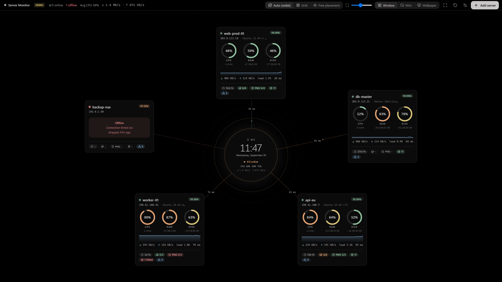
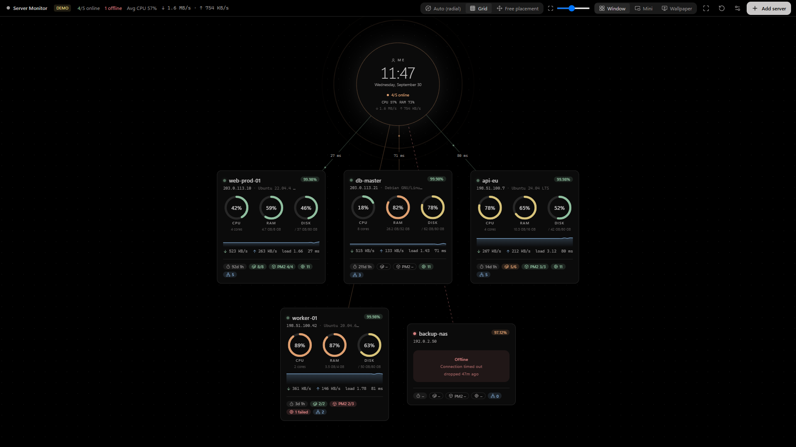
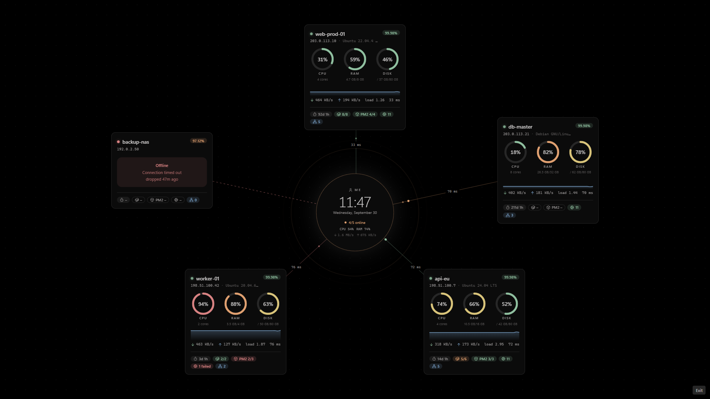
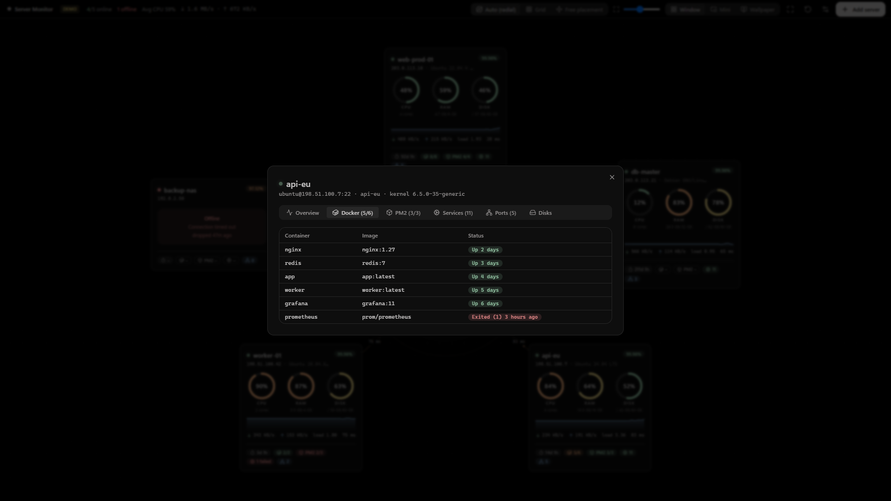

<div align="center">

# Server Monitor

**Your servers, live on your desktop.** A Windows app that watches your Linux servers over SSH and draws them as a live flowchart with you at the centre, as a normal window, a tiny always-on-top widget, or **as your desktop wallpaper**.

[](https://github.com/hacimertgokhan/server-monitor/actions/workflows/ci.yml)
[](LICENSE)


[Türkçe](README.tr.md) · [Watch the 20 s promo (with sound)](docs/media/promo.mp4)


</div>

## Features

- **Live per-server card**: CPU, RAM and disk rings that glide smoothly between values, CPU sparkline, network throughput, load, latency.
- **Uptime tracking**: server uptime plus measured availability (24 h / 7 d / 30 d) and outage counter.
- **Docker, PM2, systemd, ports**: running/total containers, PM2 processes, running and failed services, listening TCP/UDP ports with public/local exposure.
- **Three modes**: window, mini widget, and **live wallpaper** rendered _between_ your desktop icons and the system wallpaper (Windows 10 and 11, including 24H2+).
- **Free or automatic layout**: radial, grid or free placement; global card size slider and per-card resize handle. Everything is remembered.
- **Tray app**: closing the window keeps monitoring in the background. `Ctrl+Alt+M` always brings you back from wallpaper mode.
- **English and Turkish** UI (automatic, switchable in Settings).
- **Secure by design**: read-only probes, credentials encrypted with Windows DPAPI, SSH host-key pinning (trust on first use).

|                                                |                                                |
| ---------------------------------------------- | ---------------------------------------------- |
|  |      |
|     |  |

## Install

Download `Server-Monitor-Setup-<version>.exe` from the [latest release](https://github.com/hacimertgokhan/server-monitor/releases/latest) and run it (per-user install, no admin rights needed). The installer is not code-signed yet, so Windows SmartScreen may ask you to confirm.

## Getting started

1. Click **Add server**, enter host, port and user, and either a password or an SSH private-key file.
2. **Test connection**, then **Save**. The card appears and starts updating every few seconds.
3. Click a card for details (Docker, PM2, services, ports, disks). Drag cards to place them freely, or pick _Auto_ / _Grid_ in the top bar.
4. Switch to **Wallpaper** in the top bar. To get back: `Ctrl+Alt+M` or the tray icon → _Window mode_.

Try it without any server: **Preview with demo** on the empty screen.

## What runs on your servers

Only read-only commands, over a single persistent SSH connection per server:
`/proc/stat`, `/proc/meminfo`, `/proc/loadavg`, `/proc/uptime`, `/proc/net/dev`, `df`, `docker ps -a`, `pm2 jlist`, `systemctl list-units`, `ss` (or `netstat`).

- Linux hosts; systemd recommended. Missing tools simply show `–`.
- `docker ps` needs the user to be in the `docker` group (or root). `pm2` is only queried if its daemon socket already exists, because `pm2 jlist` would otherwise start a daemon.
- The environment of PM2 processes is discarded immediately and never stored.

## Security

| Concern            | What the app does                                                                                                                 |
| ------------------ | --------------------------------------------------------------------------------------------------------------------------------- |
| Credentials        | Encrypted with Electron `safeStorage` (Windows DPAPI) in `%APPDATA%\server-monitor\servers.json`. Refuses to store in plain text. |
| Host keys          | Pinned on first connect. A changed key blocks the connection and warns about a possible MITM.                                     |
| Remote commands    | Read-only, fixed scripts (see `src/main/probe.ts`). No user-supplied input reaches a shell.                                       |
| Renderer isolation | `contextIsolation`, sandbox, no Node integration, strict CSP in production builds.                                                |

Report vulnerabilities as described in [SECURITY.md](SECURITY.md).

## Development

Requires Node.js ≥ 22 on Windows (the wallpaper and DPAPI parts are Windows-specific; the UI also runs in a browser with demo data).

```bash
npm install
npm run dev        # Electron app with hot reload
npm run dev:web    # UI only, in the browser, with demo data: http://localhost:5199/?mode=window|mini|wallpaper
npm run check      # lint + format check + typecheck + tests
npm run dist       # build the Windows installer into dist/
npm run promo      # regenerate docs/media (needs Chrome + ffmpeg; narration uses Windows SAPI, fully headless)
```

```
src/main      Electron main process: SSH sessions, probes, storage, tray, window modes, wallpaper attach
src/preload   Typed IPC bridge (contextBridge)
src/renderer  React UI (Tailwind v4, shadcn/ui, @xyflow/react, framer-motion)
src/shared    Types shared between processes
scripts/promo Reproducible promo video and screenshots
```

Stack: Electron · React 19 · TypeScript · Vite (electron-vite) · Tailwind CSS v4 · shadcn/ui (Radix) · @xyflow/react · framer-motion · ssh2 · Vitest · ESLint · Prettier. Palette: Monochrome Ash (`#000000 #272727 #5c5959 #969393 #c9c7c7`) with soft status accents.

See [CONTRIBUTING.md](CONTRIBUTING.md) before opening a pull request.

## Known limitations

- Wallpaper mode uses the primary display.
- Availability is measured only while the app is running.
- Windows only for the packaged app; SSH targets must be Linux.

## License

[MIT](LICENSE) © Hacı Mert Gökhan
